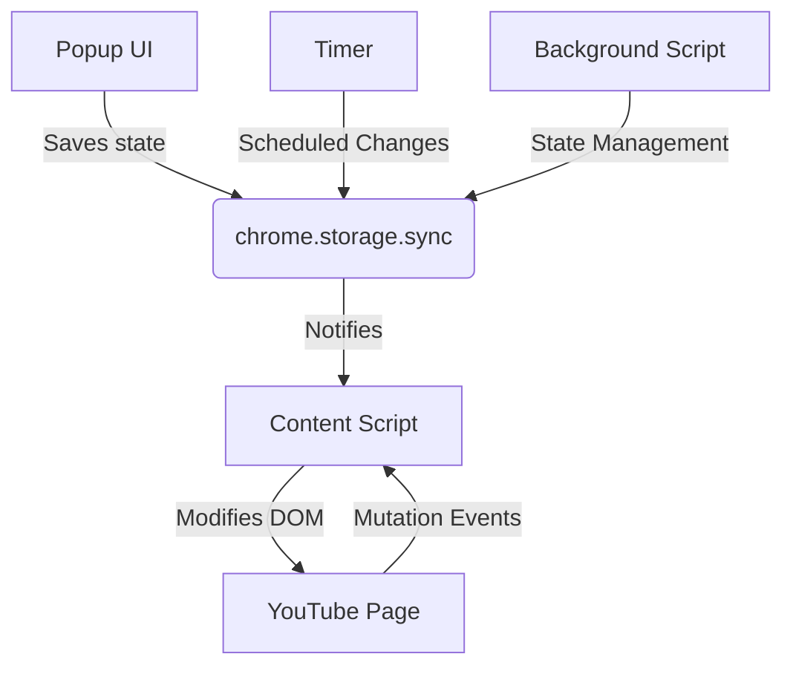

# TracTube Architecture

## System Overview

TracTube is a Chrome extension that modifies YouTube's UI by selectively hiding distracting elements. The extension uses a combination of content scripts, background scripts, and a popup UI for configuration.

## Core Components

### 1. Content Scripts (`content.js`)

- Injected into YouTube pages
- Manages feature states and DOM modifications
- Uses MutationObserver for dynamic content
- Handles SPA navigation changes
- Implements feature restoration

#### State Management

- Uses `chrome.storage.sync` for cross-device state persistence
- Maintains global `featureStates` object
- Handles main toggle and individual feature states
- Implements state restoration on disable

#### DOM Observation Strategy

- Watches specific YouTube elements:
  - Feed elements (YTD-RICH-GRID-RENDERER, YTD-RICH-ITEM-RENDERER)
  - Video elements (YTD-THUMBNAIL, YTD-VIDEO-RENDERER)
  - Navigation elements (YTD-FEED-FILTER-CHIP-BAR-RENDERER)
  - Interactive elements (comments, live chat)
  - Product/merch elements
- Optimizes performance with targeted observation
- Disconnects observer when features disabled

#### Navigation Handling

- Tracks URL changes for SPA navigation
- Monitors YouTube's loading bar progress
- Re-applies features after navigation complete
- Sets up video-specific listeners on watch pages

### 2. Background Script (`background.js`)

- Manages extension state
- Handles storage operations
- Coordinates between popup and content scripts
- Manages timer functionality

### 3. Popup UI (`popup.html`, `popup.js`, `popup.css`)

- Provides user interface for toggling features
- Implements timer functionality
- Manages theme switching
- Handles confirmation dialogs

## Feature Implementation

### Feature Structure

Each feature follows a consistent pattern:

1. Namespace creation in `window.TracTube`
2. State tracking variables
3. Main handler function
4. Restoration function
5. Event listeners (if needed)

### Example Feature Flow (Hide Comments)

1. User toggles feature in popup
2. State saved to chrome.storage.sync
3. Content script receives update
4. MutationObserver detects comments section
5. Applies CSS class to hide elements

### Feature Restoration

- Each feature has dedicated restore function
- Removes custom styles and classes
- Restores original element visibility
- Cleans up event listeners
- Handles edge cases (e.g., theater mode)

## Data Flow



## Key Technical Details

### MutationObserver Usage

- Watches for dynamic content loading
- Uses specific element selectors:
  ```javascript
  tagName === 'YTD-RICH-GRID-RENDERER' ||
    tagName === 'YTD-VIDEO-RENDERER' ||
    classList.contains('ytd-shorts');
  ```
- Optimizes performance with selective observation
- Handles cleanup on feature disable

### CSS Approach

- Uses class-based toggling (`tractube-hidden`)
- Minimal !important usage
- Responsive to YouTube's layout changes
- Maintains layout consistency with placeholders

### Performance Optimizations

- Debounced DOM operations
- Selective observation scopes
- Efficient selectors
- Event listener cleanup
- Navigation state tracking
- Cached DOM references

### Error Handling

- Graceful feature restoration
- Navigation state verification
- DOM mutation retry mechanism
- Storage operation fallbacks
- Event listener cleanup

## Dependencies

- Chrome Extension APIs
  - storage.sync
  - runtime messaging
  - tabs
- No external libraries

## Extension Lifecycle

1. Installation

   - Loads content scripts
   - Sets default states
   - Initializes storage

2. Page Load

   - Initializes observers
   - Loads saved states
   - Sets up feature handlers

3. Feature Toggle

   - Updates storage
   - Modifies DOM
   - Handles restoration

4. Navigation

   - Detects URL changes
   - Waits for page load
   - Re-applies features

5. Uninstall
   - Removes modifications
   - Cleans up storage
   - Restores original state
